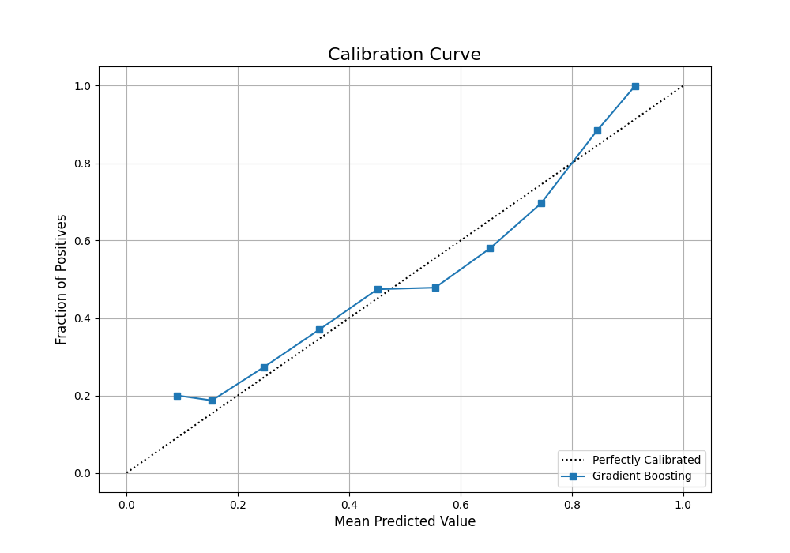

# Machine Learning for Tennis Match Prediction and Betting (Improved Model)

This project uses machine learning to predict the outcomes of professional ATP tennis matches and implements an improved betting strategy to capitalize on these predictions. This repository contains the code and documentation for a model that achieves a **9.31% profit per match** on the 2016-2017 seasons.

---

## Project Overview

The project follows a two-stage process:

1.  **Prediction Model**: A `GradientBoostingClassifier` is trained on 15 years of historical match data (2001-2015) to predict the winner of a match. The model uses a rich feature set derived from player statistics, rankings, and historical betting odds.
2.  **Betting Strategy**: A dynamic betting strategy, based on the principles of the Kelly Criterion, uses the model's calibrated probability outputs to identify and bet on matches where there is a positive expected value.

This approach improves upon the original project report by using a more powerful model and a more methodologically sound chronological train-test split, preventing data leakage.

---

## Final Results on Test Set (2016-2017 Seasons)

The model was evaluated on a separate test set of 707 matches from the 2016 and 2017 seasons, a period it had never seen during training.

| Metric                  | Result                |
| ----------------------- | --------------------- |
| Prediction Accuracy     | 66.70%                |
| Total Matches Bet On    | 512 / 707 (72.4%)     |
| Total Winnings          | $65.80                |
| **Profit per Match (ROI)** | **9.31%** |

The key finding of this project is that a well-calibrated model combined with a selective betting strategy can be highly profitable (nearly 3x the original report's profit), even with a modest prediction accuracy.



---

## How to Run This Project

### 1. Prerequisites
* Python 3.8+
* The required libraries are listed in `requirements.txt`.

### 2. Installation
Clone the repository and install the necessary packages:

```bash
git clone <your-repository-url>
cd <your-repository-name>

pip install -r requirements.txt

