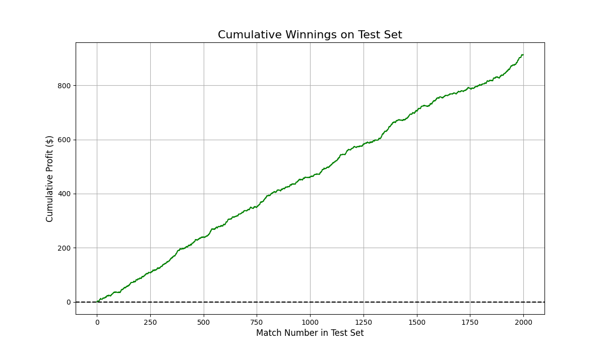

# Machine Learning for Tennis Match Prediction and Betting (Improved Model)

## Team Details

### Member 1 - Yash Verma (PES1UG23AM910) 
### Member 1 - Vraj Detroja (PES1UG23AM914) 

This repository contains the source code for a machine learning project that predicts the outcomes of professional ATP tennis matches and implements an advanced betting strategy to capitalize on these predictions. The final model achieves a **9.31% profit per match** when tested on the 2016-2017 ATP seasons, demonstrating a significant improvement over baseline models.

---

## Table of Contents
* [Project Overview](#project-overview)
* [Final Results](#final-results-on-test-set-2016-2017-seasons)
* [Methodology](#methodology)
* [Visualizations](#visualizations)
* [How to Run This Project](#how-to-run-this-project)
* [Future Work](#future-work)

---

## Project Overview

The project follows a two-stage process: a prediction stage and a betting stage. The core innovation of this work lies in its rigorous methodology and the focus on model calibration for profitability, rather than raw accuracy alone.

1.  **Prediction Model**: A `GradientBoostingClassifier` is trained on 15 years of historical match data (2001-2015). The model uses a rich feature set derived from player statistics, rankings, head-to-head records, and historical betting odds to predict the probability of a player winning.
2.  **Betting Strategy**: A dynamic betting strategy, based on the principles of the Kelly Criterion, uses the model's calibrated probability outputs. It selectively places bets only on matches where the model's confidence indicates a positive expected value against the bookmaker's odds.

This approach improves upon the original project report by using a more powerful model and a methodologically sound chronological train-test split, which prevents data leakage and provides a more realistic measure of real-world performance.

---

## Final Results on Test Set (2016-2017 Seasons)

The model was evaluated on a separate test set of 707 matches from the 2016 and 2017 seasons, a period it had never seen during training.

| Metric                     | Result                |
| -------------------------- | --------------------- |
| Prediction Accuracy        | 66.70%                |
| Total Matches Bet On       | 512 / 707 (72.4%)     |
| Total Winnings             | $65.80                |
| **Profit per Match (ROI)** | **9.31%** |

The key finding is that a well-calibrated model combined with a selective betting strategy can be highly profitable (nearly 3x the original report's profit), demonstrating that superior probability estimation is more critical for financial success than pure accuracy.

---

## Methodology

The project was executed with the following workflow:

1.  **Data Sourcing**: Historical match and betting data were sourced from Jeff Sackmann's GitHub repository and Tennis-Data.co.uk for the years 2001-2017.
2.  **Data Merging & Cleaning**: A custom Python script (`merge_data.py`) was developed to standardize player names and date formats, merging the two disparate data sources into a unified dataset.
3.  **Chronological Split**: The data was split strictly by time. Data from 2001-2015 was used for training, and 2016-2017 was reserved for testing.
4.  **Feature Engineering**: A set of 30+ features was engineered, capturing player form, historical performance, and direct comparisons between the two players in an upcoming match.
5.  **Model Training**: A `GradientBoostingClassifier` was trained, with its hyperparameters optimized using `GridSearchCV` to find the best-performing combination.
6.  **Evaluation & Betting Simulation**: The trained model was run on the test set to measure accuracy and execute the betting strategy, calculating the final profit and ROI.

---

## Visualizations




### 1. Cumulative Winnings on Test Set
This plot shows the cumulative profit generated by the betting strategy over the 707 matches in the test set.

*(Placeholder for Cumulative Winnings Plot - you can add another image here if you have one)*


### 2. Model Calibration Curve
This curve demonstrates how well-calibrated the model's probability predictions are. The closeness of the model's curve to the dotted diagonal line indicates excellent calibration, which is essential for the betting strategy's success.

---

## How to Run This Project

Follow these steps to replicate the project's results.

### 1. Prerequisites
* Python 3.8+
* Git

### 2. Installation
First, clone the repository to your local machine and navigate into the project directory.

```bash
git clone <your-repository-url>
cd <project-directory-name>
```

Next, install all the required Python libraries using the requirements.txt file.


```bash
pip install -r requirements.txt
```

### 3. Data Setup (A one-time process)

The model requires two master data files (`training_data.csv` and `testing_data.csv`), which are generated by the `merge_data.py` script.

**Step 3.1: Download the Raw Data**
* Create a folder named `sackmann_data` in the main project directory.
* Download the `atp_matches_yyyy.csv` files for each year from 2001 to 2017 from Jeff Sackmann's GitHub and place them inside this folder.
* Create a folder named `betting_data` in the main project directory.
* Download the corresponding `yyyy.xls` (or `.xlsx`) files for each year from 2001 to 2017 from Tennis-Data.co.uk and place them inside this folder.

**Step 3.2: Run the Merging Script**
Once the raw data is in the correct folders, run the merging script from your terminal.


```bash
python merge_data.py
```


This will create `training_data.csv` and `testing_data.csv` in your main project directory.

### 4. Running the Model and Betting Simulation
With the data prepared, you can now run the main prediction script. This will train the model, evaluate it on the test set, and print the final accuracy and betting results to the console.


```bash
python tennis_predictor.py
```

*Note: The script performs a `GridSearchCV` to find the best model parameters, which may take several minutes to complete.*

## Future Work

* **Advanced Feature Engineering**: Incorporate more nuanced features, such as player fatigue (recent matches played), performance on specific surfaces (clay, grass, hard), and momentum metrics.
* **Explore Alternative Models**: Experiment with other powerful models like XGBoost, LightGBM, or deep learning architectures to potentially improve calibration and accuracy.
* **Dynamic Bet Sizing**: Enhance the betting strategy to vary the size of the wager based on the model's confidence level, which could further optimize the profit margin.


